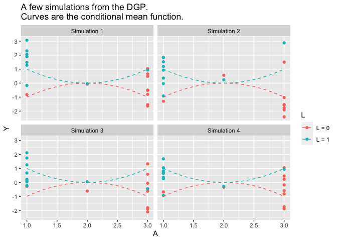

Exercise: Inverse Probability Weighting and Marginal Structural Models
================
Ian Lundberg
2022-10-06

Note for Python users: This exercise is set up for R users. The exercise
will also work for Python users. So that Python users do not have to run
the data generation functions, I have pre-generated 1,000 samples from
`generate_data()` and 10,000 samples from
`generate_data_for_stabilized()`. These are available in
[sim.csv](https://github.com/ilundberg/teaching/tree/master/info_6751_causal/class_exercises/marginal_structural_models/sim.csv)
and
[sim_stabilized_out.csv](https://github.com/ilundberg/teaching/tree/master/info_6751_causal/class_exercises/marginal_structural_models/sim_stabilized_out.csv).
In each file, an additional column

indexes the simulated samples. You could run your estimator on each
sample defined by
.

# Setup: Prepare environment and generate data.

Set seed for reproducibility.

``` r
set.seed(14850)
```

Load packages.

``` r
library(tidyverse)
library(doParallel)
library(doRNG)
```

Prepare for parallel computing to speed up simulations.

``` r
cl <- makeCluster(detectCores())
registerDoParallel(cl)
```

Below is a data generating process in which

-   Confounding exists:
    -   when
        ,
        for 80% of cases
        
    -   when
        ,
        for 80% of cases
        
-   The conditional mean response surface is highly nonlinear
    -   when
        ,
         = - (A - 2)^2")
    -   when
        ,
         = (A - 2)^2")
-   The structural response surface marginalized over
    
    is linear
    -    = 0")
        for all
        

This is an intentionally-chosen setting designed so that marginal
structural models will perform well.

``` r
generate_data <- function(n) {
  L0_set <- rep(1:3, c(1,1,8))
  L1_set <- rep(1:3, c(8,1,1))
  
  d <- data.frame(L = 0,
                  A = rep(L0_set, ceiling(n / (2*10)))) %>%
    bind_rows(data.frame(L = 1,
                         A = rep(L1_set, ceiling(n / (2*10))))) %>%
    filter(1:n() <= n) %>%
    mutate(Y = rnorm(n(), 
                     mean = case_when(L == 0 ~ - (A - 2) ^ 2,
                                      L == 1 ~ (A - 2) ^ 2),
                     sd = 1))
}
```

<!-- -->

In the data generating process above, the true
 = 0")
at each value of
.

``` r
truth <- data.frame(A = 1:3, truth = 0)
```

# 1. Define estimators

Define three estimators that will apply to samples drawn from
`generate_data()`.

1.  **Outcome estimator.** Estimate by modeling the outcome given
    treatment and confounders.
    -   Use saturated linear regression or conditional means to model
        
        the outcome nonparametrically as a function of
        .
    -   Apply the
        -formula
         = E(E(Y\mid L,A = a))").
2.  **Inverse probability weighting estimator.** Estimate by reweighting
    observed outcomes.
    -   Nonparametrically estimate the conditional probability of
        treatment,
        ").
    -   Define a weight
        
    -   Estimate
         = E\left(\frac{\mathbb{I}(A = a)Y}{\pi}\right)"),
        using the weighted mean of
        
        among those with
        
        weighted by
        .
3.  **Marginal structural model estimator.** Estimate by a weighted
    linear regression.
    -   Nonparametrically estimate the conditional probability of
        treatment,
        ").
    -   Define a weight
        
    -   Estimate
         = E\left(\frac{\mathbb{I}(A = a)Y}{\pi}\right)"),
        using the weighted mean of
        
        among those with
        
        weighted by
        .

Note: Because both (2) and (3) require a weight, you might write a
function that takes a data frame and appends a weight.

Here is some skeleton code:

``` r
# Function to conduct outcome modeling
outcome_estimator <- function(data) {
  # Estimate E(Y | A, L) by saturated linear regression:
  # input A as a factor and interact it with L.
  # Predict E(Y | A = a, L) for all units.
  # Return a data.frame with two columns:
  #  A = 1:3
  #  estimate = [your three estimates]
}
# Function to create inverse probability weights
create_ipw <- function(data) {
  # Calculate inverse probability weights
  # Append them as a new column in data
  # Return that data frame
}
# Function to create inverse probability weights
ipw_estimator <- function(data) {
  # Call create_ipw() to append inverse probability weights to data
  # Group by A and take the weighted mean of Y
  # Return a data.frame with two columns
  #   A = 1:3
  #   estimate = [your three estimates]
}
# Function to create inverse probability weights
msm_estimator <- function(data) {
  # Call create_ipw() to append inverse probability weights to data
  # Fit an additive linear regression of Y on {A,L},
  # with each predictor entered as numeric (to assume linearity)
  # Return a data.frame with two columns
  #   A = 1:3
  #   estimate = [your three estimates]
}
```

# 2. Apply your estimators to one sample from `generate_data()`

I suggest setting
.

Compare the results from the IPW estimator and the outcome estimator.
What do you notice?

# 3. Apply your estimators to many samples from `generate_data()`

I suggest

repetitions with
.

Calculate 9 mean squared error estimates for the

-   3 estimands:
    ,E(Y^2),E(Y^3)")
-   3 estimators: outcome modeling, IPW, MSM

Which estimator has the best MSE? Thinking about the data generating
process, why is the difference most dramatic for
")?

# 4. Vary the sample size

Repeat the simulation for
.
Visualize MSE as a function of sample size.

Think about which has better MSE: \* MSM with

observations \* IPW with

observations

Why do you think we see this result?

# 5. Challenge. Stabilized weights.

Stabilized weights
}{P(A = a_i \mid L = \ell_i)}")
can yield improved efficiency when

-   ")
    is not uniform
-   The MSM is not saturated

Below is a new data generating process to generate data that satisfy
these conditions:
 > P(A = 3)")
in this simulation.

``` r
generate_data_for_stabilized <- function(n) {
  L0_set <- rep(1:3, c(4,1,5))
  L1_set <- rep(1:3, c(8,1,1))
  
  d <- data.frame(L = 0,
                  A = rep(L0_set, ceiling(n / (2*10)))) %>%
    bind_rows(data.frame(L = 1,
                         A = rep(L1_set, ceiling(n / (2*10))))) %>%
    filter(1:n() <= n) %>%
    mutate(Y = rnorm(n(), 
                     mean = case_when(L == 0 ~ - (A - 2) ^ 2,
                                      L == 1 ~ (A - 2) ^ 2),
                     sd = 1))
}
```

This challenge question is to:

-   Write an estimator that calculates stabilized weights and estimates
    a MSM using the stabilized weights.
-   Apply your original MSM estimator and your stabilized estimator at
    
    for
    
    simulations.
-   Calculate mean squared error.

Do stabilized weights improve performance?
