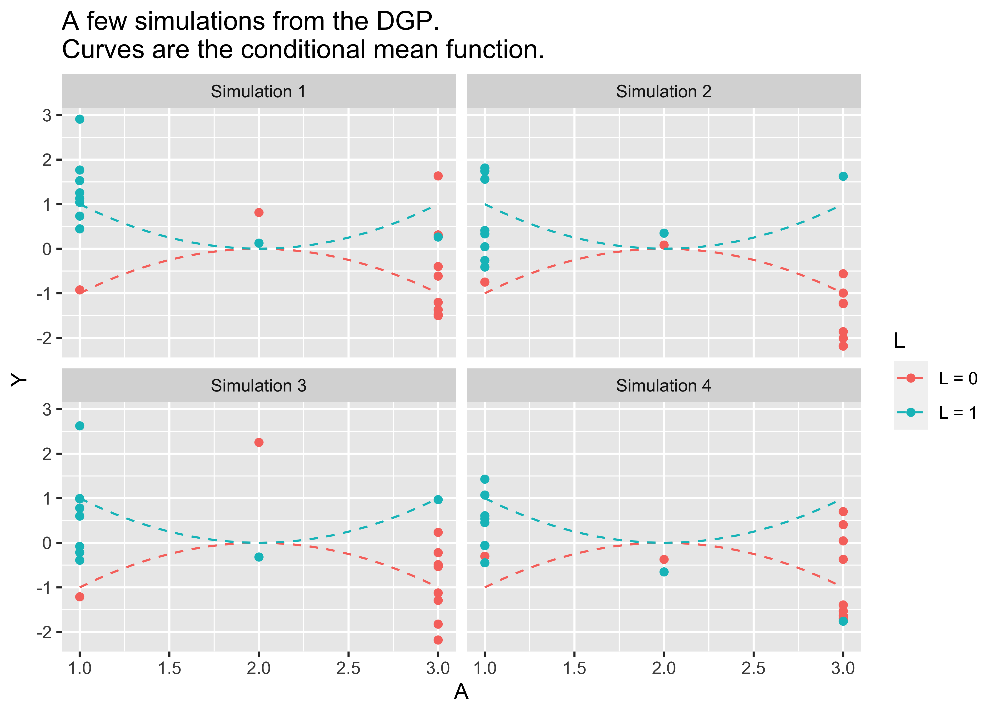
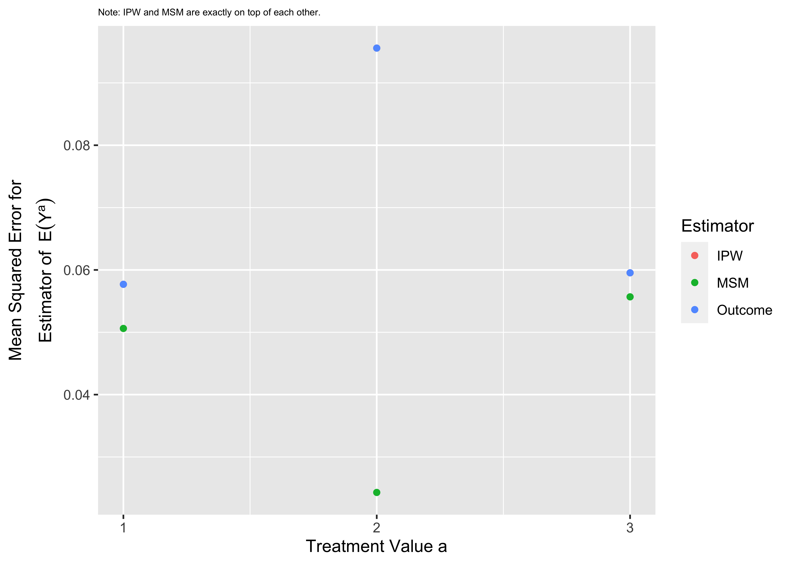
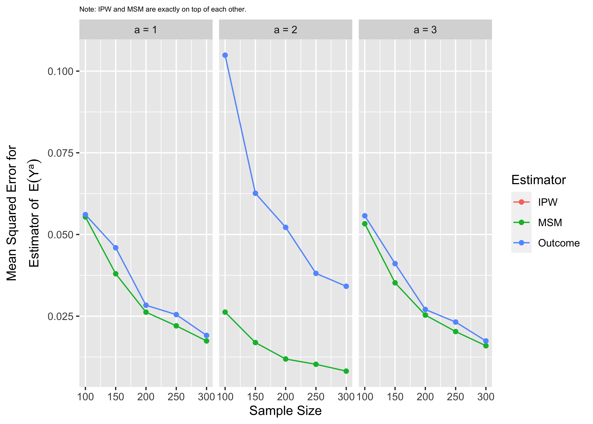
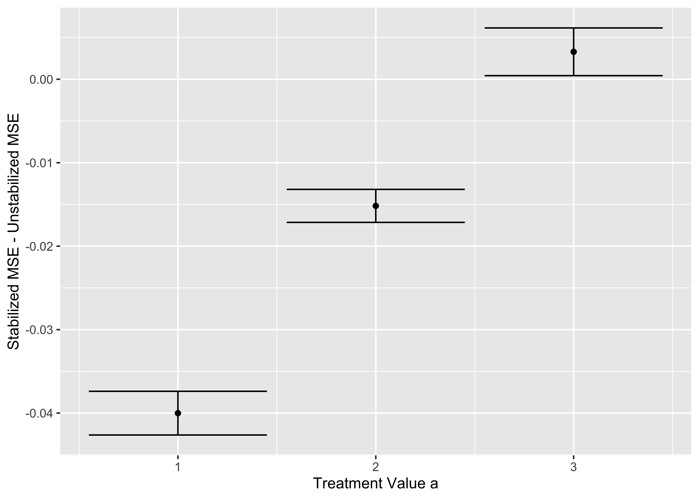

Exercise: Inverse Probability Weighting and Marginal Structural Models
================
Ian Lundberg
2022-10-06

Note for Python users: This exercise is set up for R users. The exercise
will also work for Python users. So that Python users do not have to run
the data generation functions, I have pre-generated 1,000 samples from
`generate_data()` and 10,000 samples from
`generate_data_for_stabilized()`. These are available in
[sim.csv](https://github.com/ilundberg/teaching/raw/master/info_6751_causal/class_exercises/marginal_structural_models/sim.csv)
and
[sim_stabilized.csv](https://github.com/ilundberg/teaching/raw/master/info_6751_causal/class_exercises/marginal_structural_models/sim_stabilized.csv).
In each file, an additional column

indexes the simulated samples. You could run your estimator on each
sample defined by
.

# Setup: Prepare environment and generate data.

Load packages.

``` r
library(tidyverse)
library(doParallel)
library(doRNG)
```

Prepare for parallel computing to speed up simulations.

``` r
cl <- makeCluster(detectCores())
registerDoParallel(cl)
```

Below is a data generating process in which

-   Confounding exists:
    -   when
        ,
        for 80% of cases
        
    -   when
        ,
        for 80% of cases
        
-   The conditional mean response surface is highly nonlinear
    -   when
        ,
         = - (A - 2)^2")
    -   when
        ,
         = (A - 2)^2")
-   The structural response surface marginalized over
    
    is linear
    -    = 0")
        for all
        

This is an intentionally-chosen setting designed so that marginal
structural models will perform well.

``` r
generate_data <- function(n) {
  L0_set <- rep(1:3, c(1,1,8))
  L1_set <- rep(1:3, c(8,1,1))
  
  d <- data.frame(L = 0,
                  A = rep(L0_set, ceiling(n / (2*10)))) %>%
    bind_rows(data.frame(L = 1,
                         A = rep(L1_set, ceiling(n / (2*10))))) %>%
    filter(1:n() <= n) %>%
    mutate(Y = rnorm(n(), 
                     mean = case_when(L == 0 ~ - (A - 2) ^ 2,
                                      L == 1 ~ (A - 2) ^ 2),
                     sd = 1))
}
```

<!-- -->

In the data generating process above, the true
 = 0")
at each value of
.

``` r
truth <- data.frame(A = 1:3, truth = 0)
```

# 1. Define estimators

Define three estimators that will apply to samples drawn from
`generate_data()`.

1.  **Outcome estimator.** Estimate by modeling the outcome given
    treatment and confounders.
    -   Use saturated linear regression or conditional means to model
        
        the outcome nonparametrically as a function of
        .
    -   Apply the
        -formula
         = E(E(Y\mid L,A = a))").
2.  **Inverse probability weighting estimator.** Estimate by reweighting
    observed outcomes.
    -   Nonparametrically estimate the conditional probability of
        treatment,
        ").
    -   Define a weight
        
    -   Estimate
         = E\left(\frac{\mathbb{I}(A = a)Y}{\pi}\right)"),
        using the weighted mean of
        
        among those with
        
        weighted by
        .
3.  **Marginal structural model estimator.** Estimate by a weighted
    linear regression.
    -   Nonparametrically estimate the conditional probability of
        treatment,
        ").
    -   Define a weight
        
    -   Estimate
        "),
        by predicting at
        
        from a weighted linear regression of
        
        on
        ,
        weighted by
        .

Note: Because both (2) and (3) require a weight, you might write a
function that takes a data frame and appends a weight.

``` r
# Function to conduct outcome modeling
outcome_estimator <- function(data) {
  fit <- lm(Y ~ factor(A)*L, data = data)
  result <- foreach(a = 1:3, .combine = "rbind") %do% {
    data.frame(A = a,
               estimate = mean(predict(fit, newdata = data %>% mutate(A = a))))
  }
  return(result)
}
# Function to create inverse probability weights
create_ipw <- function(data) {
  # 1. Estimate pi_i = P(A = a_i | L = l_i) for each unit
  data_with_weights <- data %>%
    # Define the size of L = l_i
    group_by(L) %>%
    mutate(L_num = n()) %>%
    # Define P(A = a_i | L = l_i) as the proportion with A = a_i
    # among the set L = l_i
    group_by(A,L) %>%
    mutate(pi = n() / L_num) %>%
    select(-L_num) %>%
    # 2. Create a weight 1 / pi_i
    mutate(w = 1 / pi) %>%
    select(-pi)
  return(data_with_weights)
}
# Function to create inverse probability weights
ipw_estimator <- function(data) {
  # Use your previous function to create inverse probability weights
  with_weights <- create_ipw(data)
  # 3. Return a data.frame with the estimated E(Y^a) for a = 1,2,3
  result <- with_weights %>%
    group_by(A) %>%
    summarize(estimate = weighted.mean(Y, w = w))
  return(result)
}
# Function to create inverse probability weights
msm_estimator <- function(data) {
  # Use your function to create inverse probability weights
  with_weights <- create_ipw(data)
  # Fit OLS for Y ~ A weighted by w_i
  fit <- lm(Y ~ A, data = with_weights, w = w)
  # Return a data.frame with the estimated E(Y^a) for a = 1,2,3
  result <- data.frame(A = 1:3)
  result$estimate <- predict(fit, newdata = result)
  return(result)
}
```

# 2. Apply your estimators to one sample from `generate_data()`

I suggest setting
.

Compare the results from the IPW estimator and the outcome estimator.
What do you notice?

Simulate one sample, apply the estimators, and report the result in a
table.

``` r
sim_data <- generate_data(100)
estimates <- outcome_estimator(sim_data) %>%
  mutate(estimator = "Outcome ") %>%
  bind_rows(ipw_estimator(sim_data) %>%
              mutate(estimator = "IPW ")) %>%
  bind_rows(msm_estimator(sim_data) %>%
              mutate(estimator = "MSM "))
# Look at results
estimates %>%
  pivot_wider(names_from = "estimator", values_from = "estimate")
```

    ## # A tibble: 3 × 4
    ##       A `Outcome ` `IPW ` `MSM `
    ##   <int>      <dbl>  <dbl>  <dbl>
    ## 1     1      0.206  0.206  0.191
    ## 2     2      0.260  0.260  0.291
    ## 3     3      0.406  0.406  0.390

IPW and outcome modeling yield the **same estimate**! This is because
these two are mathematically equivalent not only in expectation, but
also in every finite sample. This occurs only when both methods are
carried out nonparametrically.

# 3. Apply your estimators to many samples from `generate_data()`

I suggest

repetitions with
.

Calculate 9 mean squared error estimates for the

-   3 estimands:
    ,E(Y^2),E(Y^3)")
-   3 estimators: outcome modeling, IPW, MSM

Which estimator has the best MSE? Thinking about the data generating
process, why is the difference most dramatic for
")?

Conduct the simulation.

``` r
R <- 1000
n <- 100
part3_sims <- foreach(r = 1:R, .combine = "rbind", .packages = "tidyverse") %dorng% {
  sim <- generate_data(n)
  ipw_estimator(sim) %>%
    mutate(estimator = "Outcome") %>%
    bind_rows(ipw_estimator(sim) %>%
                mutate(estimator = "IPW")) %>%
    bind_rows(msm_estimator(sim) %>%
                mutate(estimator = "MSM"))
} 
```

Calculate performance

``` r
part3_performance <- part3_sims %>%
  left_join(truth, by = "A") %>%
  group_by(A,estimator) %>%
  summarize(mse = mean((estimate - truth) ^ 2))
```

    ## `summarise()` has grouped output by 'A'. You can override using the `.groups`
    ## argument.

Visualize the result

``` r
part3_performance %>%
  ggplot(aes(x = A, y = mse, color = estimator)) +
  geom_point() +
  xlab("Treatment Value a") +
  scale_x_continuous(breaks = 1:3) +
  ylab(expression(atop('Mean Squared Error for','Estimator of '~E(Y^a)))) +
  scale_color_discrete(name = "Estimator") +
  ggtitle("Note: IPW and MSM are exactly on top of each other.") +
  theme(plot.title = element_text(size = 6))
```

<!-- -->

# 4. Vary the sample size

Repeat the simulation for
.
Visualize MSE as a function of sample size.

Think about which has better MSE: \* MSM with

observations \* IPW with

observations

Why do you think we see this result?

Conduct the simulation.

``` r
R <- 1000
part4_sims <- foreach(r = 1:R, .combine = "rbind", .packages = c("tidyverse","foreach")) %dorng% {
  foreach(n = c(100,150,200,250,300), .combine = "rbind") %do% {
    sim <- generate_data(n)
    ipw_estimator(sim) %>%
      mutate(estimator = "Outcome") %>%
      bind_rows(ipw_estimator(sim) %>%
                  mutate(estimator = "IPW")) %>%
      bind_rows(msm_estimator(sim) %>%
                  mutate(estimator = "MSM")) %>%
      mutate(n = n)
  }
} 
```

Calculate performance

``` r
part4_performance <- part4_sims %>%
  left_join(truth, by = "A") %>%
  group_by(A,estimator,n) %>%
  summarize(mse = mean((estimate - truth) ^ 2))
```

    ## `summarise()` has grouped output by 'A', 'estimator'. You can override using
    ## the `.groups` argument.

Visualize the result

``` r
part4_performance %>%
  mutate(A = paste0("a = ",A)) %>%
  ggplot(aes(x = n, y = mse, color = estimator)) +
  geom_point() +
  geom_line() +
  facet_wrap(~A) +
  xlab("Sample Size") +
  ylab(expression(atop('Mean Squared Error for','Estimator of '~E(Y^a)))) +
  scale_color_discrete(name = "Estimator") +
  ggtitle("Note: IPW and MSM are exactly on top of each other.") +
  theme(plot.title = element_text(size = 6))
```

<!-- -->

All estimators perform better as the sample size grows, but the MSM
advantage for
")
is substantial. Performance of the MSM at

is superior to performance of the IPW estimator at
,
despite the latter being three times the sample size.

# 5. Challenge. Stabilized weights.

Stabilized weights
}{P(A = a_i \mid L = \ell_i)}")
can yield improved efficiency when

-   ")
    is not uniform
-   The MSM is not saturated

Below is a new data generating process to generate data that satisfy
these conditions:
 > P(A = 3)")
in this simulation.

``` r
generate_data_for_stabilized <- function(n) {
  L0_set <- rep(1:3, c(4,1,5))
  L1_set <- rep(1:3, c(8,1,1))
  
  d <- data.frame(L = 0,
                  A = rep(L0_set, ceiling(n / (2*10)))) %>%
    bind_rows(data.frame(L = 1,
                         A = rep(L1_set, ceiling(n / (2*10))))) %>%
    filter(1:n() <= n) %>%
    mutate(Y = rnorm(n(), 
                     mean = case_when(L == 0 ~ - (A - 2) ^ 2,
                                      L == 1 ~ (A - 2) ^ 2),
                     sd = 1))
}
```

This challenge question is to:

-   Write an estimator that calculates stabilized weights and estimates
    a MSM using the stabilized weights.
-   Apply your original MSM estimator and your stabilized estimator at
    
    for
    
    simulations.
-   Calculate mean squared error.

Do stabilized weights improve performance?

Define a function to create stabilized weights.

``` r
create_stabilized_ipw <- function(data) {
  # 1. Estimate pi_i = P(A = a_i | L = l_i) for each unit
  data_with_weights <- data %>%
    # Define the size of L = l_i
    group_by(L) %>%
    mutate(L_num = n()) %>%
    # Define P(A = a_i | L = l_i) as the proportion with A = a_i
    # among the set L = l_i
    group_by(A,L) %>%
    mutate(LA_num  = n()) %>%
    group_by(A) %>%
    mutate(A_num = n()) %>%
    ungroup() %>%
    mutate(numerator = A_num / n(),
           denominator = LA_num / L_num,
           w = numerator / denominator) %>%
    select(L, A, Y, w)
  return(data_with_weights)
}
```

Define an MSM estimator using the stabilized weight function.

``` r
msm_estimator_stabilized <- function(data) {
  # Use your function to create inverse probability weights
  with_weights <- create_stabilized_ipw(data)
  # Fit OLS for Y ~ A weighted by w_i
  fit <- lm(Y ~ A, data = with_weights, w = w)
  # Return a data.frame with the estimated E(Y^a) for a = 1,2,3
  result <- data.frame(A = 1:3)
  result$estimate <- predict(fit, newdata = result)
  return(result)
}
```

Conduct the simulation

``` r
R <- 10000
n <- 20
part5_sims <- foreach(r = 1:R, .combine = "rbind", .packages = c("tidyverse","foreach")) %dorng% {
  sim <- generate_data_for_stabilized(n)
  msm_estimator_stabilized(sim) %>%
    rename(stabilized = estimate) %>%
    left_join(msm_estimator(sim) %>%
                rename(unstabilized = estimate))
}
```

Visualize the result

``` r
part5_sims %>%
  mutate(diff = stabilized ^ 2 - unstabilized ^ 2) %>%
  group_by(A) %>%
  summarize(diff_mean = mean(diff),
            diff_se = sd(diff) / sqrt(n())) %>%
  mutate(diff_min = diff_mean - qnorm(.975) * diff_se,
         diff_max = diff_mean + qnorm(.975) * diff_se) %>%
  ggplot(aes(x = A, y = diff_mean,
             ymin = diff_min, ymax = diff_max)) +
  geom_point() +
  geom_errorbar() +
  ylab("Stabilized MSE - Unstabilized MSE") +
  xlab("Treatment Value a")
```

<!-- -->

The MSM with stabilized weights is superior for
"),
somewhat superior for
"),
and about the same for
").
This makes sense because

is the most common treatment value in this setting, and stabilized
weights avoid down-weighting this treatment in the MSM model.
